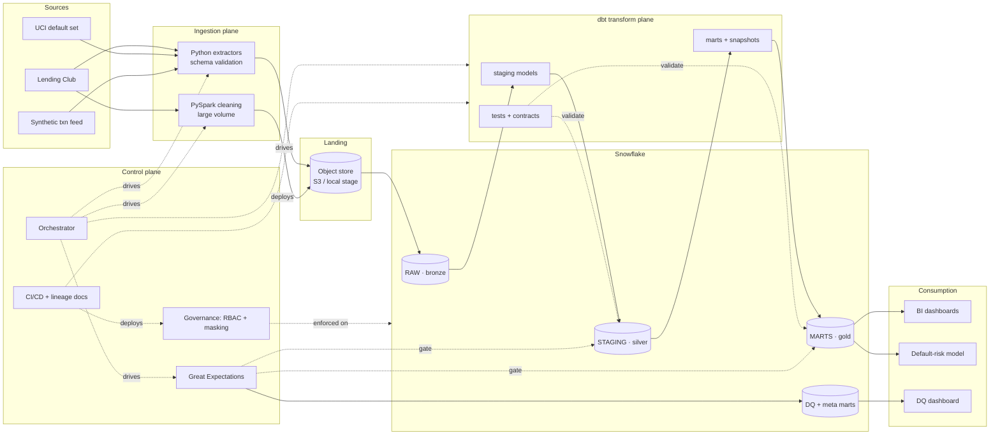

# CreditPulse — Production Architecture

This document describes the platform as a **production-grade system**: components, data flow, layering, environments, contracts, security, failure handling, and scaling. The companion [`README.md`](./README.md) covers setup and the project overview. Where a production component (Snowflake, S3, Airflow) has a free local equivalent, both are noted so the same design runs on a laptop or in the cloud.

---

## Table of contents

1. [Design principles](#1-design-principles)
2. [Logical architecture](#2-logical-architecture)
3. [Component reference](#3-component-reference)
4. [Data flow — end to end](#4-data-flow--end-to-end)
5. [Medallion layering & modeling](#5-medallion-layering--modeling)
6. [Data contracts & SLAs](#6-data-contracts--slas)
7. [Data quality architecture](#7-data-quality-architecture)
8. [Governance & security architecture](#8-governance--security-architecture)
9. [Orchestration & scheduling](#9-orchestration--scheduling)
10. [CI/CD & environment promotion](#10-cicd--environment-promotion)
11. [Observability, alerting & lineage](#11-observability-alerting--lineage)
12. [Scaling, cost & performance](#12-scaling-cost--performance)
13. [Failure modes & recovery](#13-failure-modes--recovery)
14. [Security threat model (summary)](#14-security-threat-model-summary)
15. [Architecture decision records](#15-architecture-decision-records)

---

## 1. Design principles

The architecture is shaped by five non-negotiables, each tied to a real risk in a lending data platform:

1. **ELT over ETL** — land raw first, transform in-warehouse. Raw fidelity means any logic bug is replayable without re-pulling source.
2. **Immutable bronze** — the RAW layer is append-only and never edited. It is the system of record and the replay source for everything downstream.
3. **Quality is a gate, not a report** — bad data is stopped *before* it reaches a dashboard or a model, not flagged after an executive has already seen it.
4. **Least privilege by default** — every role gets the minimum access; PII is masked unless a role is explicitly authorized.
5. **Everything as code** — models, tests, roles, masking policies, and infrastructure are version-controlled and promoted through Git, not clicked in a UI.

---

## 2. Logical architecture



The system separates into three planes:

- **Data plane** — where data physically moves and lands (ingestion → object store → Snowflake layers).
- **Transform plane** — dbt, which holds all business logic as version-controlled SQL.
- **Control plane** — orchestration, quality, governance, and CI/CD that operate *on* the data plane without being part of the data itself.

---

## 3. Component reference

| Component | Responsibility | Production | Local swap |
| --- | --- | --- | --- |
| **Extractors** | Pull source data, validate schema/headers, write raw files with metadata (load ts, source, row count) | Python services on a scheduler | Python scripts |
| **Spark cleaner** | Distributed cleaning/standardization of the high-volume loan tape | PySpark on EMR / Databricks | local PySpark |
| **Object store** | Immutable raw landing zone, partitioned by `source/load_date` | AWS S3 | local `./lake/raw` |
| **Stage** | Bridge between object store and warehouse | Snowflake external stage + Snowpipe | dbt-duckdb external read |
| **Warehouse** | Storage + compute for all layers | Snowflake (separate XS warehouses for ELT vs BI) | DuckDB file |
| **dbt** | All transformations, tests, snapshots, contracts, lineage, docs | dbt Cloud / dbt-core | dbt-core |
| **Great Expectations** | Distributional & volume quality gates | GE + checkpoint store | same |
| **Orchestrator** | Schedules and sequences the pipeline, retries, alerts | Airflow / Dagster | GitHub Actions cron |
| **Governance** | RBAC, masking, row policies, tagging | Snowflake native | DuckDB (simulated via views) |
| **BI** | Dashboards on gold marts | Tableau / Power BI | Streamlit / Tableau Public |
| **ML** | Default-prediction training & evaluation | scikit-learn / XGBoost | same |
| **Secrets** | Credential storage | AWS Secrets Manager | `.env` + GitHub Secrets |

---

## 4. Data flow — end to end

A single nightly run executes this sequence. Each step is idempotent and safe to re-run.

```
1. EXTRACT
   Python extractors fetch source files, validate against expected schema
   (column set + types + header), and write to:
       s3://creditpulse/raw/<source>/load_date=YYYY-MM-DD/part-*.parquet
   Metadata sidecar records: row count, byte size, source checksum.

2. CLEAN (high-volume only)
   PySpark reads the Lending Club tape, standardizes types, trims/normalizes
   strings, deduplicates on natural key, repartitions, writes back to raw-clean.

3. LOAD → RAW (bronze)
   COPY INTO from external stage into RAW tables. Append-only;
   each row stamped with _loaded_at, _source_file, _load_date.
   In production, Snowpipe auto-ingests the synthetic feed incrementally.

4. TRANSFORM → STAGING (silver)
   dbt builds one staging model per source: enforce types, rename to the
   project naming standard, deduplicate, tag PII columns, apply not_null/unique.

5. TRANSFORM → MARTS (gold)
   dbt builds conformed dims/facts, risk marts, and the ML feature table.
   Snapshots capture SCD2 history for borrower attributes.

6. VALIDATE
   dbt tests run inline during build (relationships, accepted_values, ranges).
   Great Expectations checkpoint runs distributional/volume checks.
   Blocking failure → pipeline halts, alert fires, downstream is NOT refreshed.

7. PUBLISH QUALITY
   GE + dbt test results written to mart_data_quality for the DQ dashboard.

8. SERVE
   BI extracts refresh from gold; model retrains on feature_default_prediction;
   freshness timestamp published.
```

The ordering guarantees that **consumption layers only ever read validated gold data** — a failed gate at step 6 means step 8 never runs.

---

## 5. Medallion layering & modeling

| Layer | Schema | Purpose | Rules |
| --- | --- | --- | --- |
| Bronze | `RAW` | Verbatim source | Append-only, immutable, partitioned by load_date, no logic |
| Silver | `STAGING` | Clean & conform | Typed, deduped, renamed, PII-tagged, 1 model per source, no joins/business logic |
| Gold | `MARTS` | Business-ready | Dimensional models, risk marts, ML features; documented & tested |
| Meta | `META` | Operational | DQ results, run logs, freshness, lineage exports |

**Modeling conventions**

- Naming: `stg_<source>__<entity>`, `int_<concept>`, `dim_<entity>`, `fct_<event>`, `mart_<subject>`.
- Grain is declared in every model's docs (e.g. `fct_payment` = one row per loan per scheduled payment).
- Surrogate keys via `dbt_utils.generate_surrogate_key`.
- Gold models carry **dbt contracts** (enforced column names + types) so a breaking schema change fails CI, not production.
- History: `snapshots/` capture SCD2 on borrower risk attributes so vintage analysis stays accurate.

---

## 6. Data contracts & SLAs

Each source declares a contract in `docs/data_contracts.md`:

| Source | Schema contract | Freshness SLA | Volume band | On breach |
| --- | --- | --- | --- | --- |
| Lending Club | fixed column set + types | weekly | ±10% vs trailing avg | block + alert |
| UCI default | fixed 24-feature schema | static (reference) | exact | block |
| Synthetic txns | event schema | < 26h stale | ±15% daily | warn, then block at 2× SLA |

Contracts are enforced at two points: **ingestion** (header/type validation rejects malformed files) and **transform** (dbt contracts + source freshness fail the run).

---

## 7. Data quality architecture

Quality runs at three depths, tiered by severity:

```
        ┌─────────────────────────────────────────────┐
        │ Depth 1 — Structural (dbt tests, inline)     │  blocking
        │  not_null · unique · relationships ·         │
        │  accepted_values · custom range tests        │
        ├─────────────────────────────────────────────┤
        │ Depth 2 — Distributional (Great Expectations)│  blocking / warn
        │  row-count band · null-rate · value ranges · │
        │  schema drift · category set drift           │
        ├─────────────────────────────────────────────┤
        │ Depth 3 — Freshness & volume (dbt source)    │  blocking
        │  max staleness · expected row delta          │
        └─────────────────────────────────────────────┘
                          │
                          ▼
              mart_data_quality  ──►  DQ dashboard (trend over time)
```

- **Blocking** checks halt the pipeline; **warning** checks log + alert but allow continuation.
- Results are persisted, so "is our data trustworthy this week vs last?" is itself a dashboard.
- A failed blocking check leaves the previous good gold tables in place — consumers see stale-but-correct data rather than fresh-but-broken data.

---

## 8. Governance & security architecture

### Role hierarchy (RBAC)

```
                 ACCOUNTADMIN
                      │
                  CP_ADMIN  ──────────────┐
                  /     \                 │
         CP_LOADER     CP_TRANSFORMER   CP_GOVERNANCE
         (write RAW)   (build STAGING/   (owns masking +
                        MARTS)            row policies)
                          │
                ┌─────────┴─────────┐
          CP_ANALYST           CP_RISK_ANALYST
        (read MARTS,           (read MARTS,
         PII masked)            PII unmasked under policy)
```

### Protection mechanisms

- **Dynamic data masking** — masking policies attached to PII-tagged columns return masked values to `CP_ANALYST` and clear values to `CP_RISK_ANALYST`. Policy logic lives in `governance/masking_policies.sql`.
- **Row-access policies** — restrict visible rows by attribute (e.g. region) to demonstrate fine-grained control.
- **Object tagging** — every column classified `PII` / `CONFIDENTIAL` / `PUBLIC`; tags drive which masking policy applies and feed the catalog.
- **Least privilege** — analysts cannot read RAW or STAGING; only governed gold marts.
- **Auth** — key-pair authentication to Snowflake; no passwords in code; secrets in a manager.
- **Auditability** — Snowflake `ACCESS_HISTORY` / query history makes "who read this PII column when?" answerable.

All governance objects are SQL in the repo and applied through CI, so access changes are reviewed in pull requests.

---

## 9. Orchestration & scheduling

The orchestrator owns *sequencing, retries, and alerting* — it does not contain business logic (that lives in dbt).

```
DAG: creditpulse_daily
  extract        ──► spark_clean ──► load_raw
                                        │
                                   dbt build  (models + inline tests)
                                        │
                                   ge_checkpoint
                                   ├─ pass ──► publish_dq ──► refresh_bi ──► retrain_model
                                   └─ fail ──► alert + stop (gold untouched)

  retries: 2 with exponential backoff on transient steps (extract, load)
  no-retry: ge_checkpoint failures (data issue, not transient)
  schedule: 02:00 daily; manual trigger available
```

Production uses Airflow/Dagster for rich dependency graphs and backfills; the free build uses a scheduled GitHub Actions workflow that runs the same shell sequence.

---

## 10. CI/CD & environment promotion

```
feature branch ──► pull request
   │
   ├─ sqlfluff lint
   ├─ dbt parse + compile
   ├─ dbt build  → CREDITPULSE_CI_*  (ephemeral, Slim CI: only changed models + downstream)
   ├─ dbt test
   └─ great_expectations validate
        │ all green
        ▼
   merge to main ──► deploy job ──► dbt build --target prod
                                    apply governance SQL
                                    refresh prod docs/lineage
```

- **Slim CI** uses dbt state deferral so PRs only rebuild changed models, keeping CI fast and cheap.
- **Isolation** — CI runs in its own database namespace; it can never touch production data.
- **Promotion is code-only** — there is no manual "edit in prod"; every prod change is a reviewed merge.

---

## 11. Observability, alerting & lineage

| Concern | Mechanism |
| --- | --- |
| Pipeline health | Orchestrator run logs + status; on-failure Slack/email with failing step + run URL |
| Freshness | `dbt source freshness`; breach blocks run and alerts |
| Data trust | `mart_data_quality` history + DQ dashboard (pass rate, null trends, volume) |
| Lineage | `dbt docs generate` → navigable DAG from RAW source column to dashboard field |
| Access audit | Snowflake access history for PII reads |
| Cost | Snowflake warehouse usage by tag (ELT vs BI) |

Lineage is the answer to the regulator/executive question — any gold column can be traced back through its silver and raw ancestors in the dbt docs site.

---

## 12. Scaling, cost & performance

- **Compute isolation** — separate Snowflake virtual warehouses for ELT and BI so heavy transforms never throttle analyst queries; each auto-suspends after 60s idle to control cost.
- **Incremental models** — large facts (`fct_payment`) are dbt incremental, processing only new partitions rather than full rebuilds.
- **Partitioning / clustering** — raw partitioned by `load_date`; large gold tables clustered on common filter keys (grade, date).
- **Spark only where it pays** — PySpark is reserved for the multi-million-row tape; small reference sets stay in pandas to avoid Spark overhead.
- **Free-mode parity** — DuckDB handles the project-scale data on a laptop with the same SQL, so the design is validated locally before any cloud spend.

---

## 13. Failure modes & recovery

| Failure | Detection | Behavior | Recovery |
| --- | --- | --- | --- |
| Source file malformed | Ingestion schema validation | File rejected, not loaded | Fix/resupply source, re-run extract |
| Feed late / missing | dbt source freshness | Run blocks | Backfill once feed lands |
| Quality gate fails | dbt test / GE checkpoint | Pipeline halts, gold untouched | Investigate via DQ mart; consumers keep last-good gold |
| Transform bug | CI dbt build/test on PR | Caught before merge | Fix in branch |
| Bad deploy reaches prod | Run alert + DQ drop | Roll back via Git revert + re-run | Immutable RAW enables full replay |
| Partial load | Idempotent COPY + load metadata | Re-run dedupes | Re-run step (idempotent) |

The combination of **immutable bronze** + **idempotent steps** means almost any failure is recoverable by replaying from RAW.

---

## 14. Security threat model (summary)

| Threat | Mitigation |
| --- | --- |
| Analyst over-exposed to PII | Dynamic masking + least-privilege roles |
| Credentials leaked in code | Secrets manager, key-pair auth, `.env` gitignored |
| Unauthorized data change | Code-only promotion, PR review, no prod UI edits |
| Silent schema drift | dbt contracts + GE schema checks fail the run |
| Undetected bad data in reports | Quality gate before serving; consumers never see ungated gold |
| No audit trail | Snowflake access history + versioned governance SQL |

---

## 15. Architecture decision records

Key decisions are documented as ADRs under `docs/adr/`. Examples:

- **ADR-001** — ELT (transform in warehouse) over ETL → enables replay & lineage.
- **ADR-002** — dbt as the single transformation tool → tests, docs, lineage in one place.
- **ADR-003** — Medallion layering → clean separation of fidelity, cleaning, business logic.
- **ADR-004** — Quality as a blocking gate → bad data never reaches consumers.
- **ADR-005** — DuckDB as the free local mirror of Snowflake → cloud-free development parity.

ADRs capture the *why*, not just the *what*, so future contributors understand the tradeoffs behind the design.
