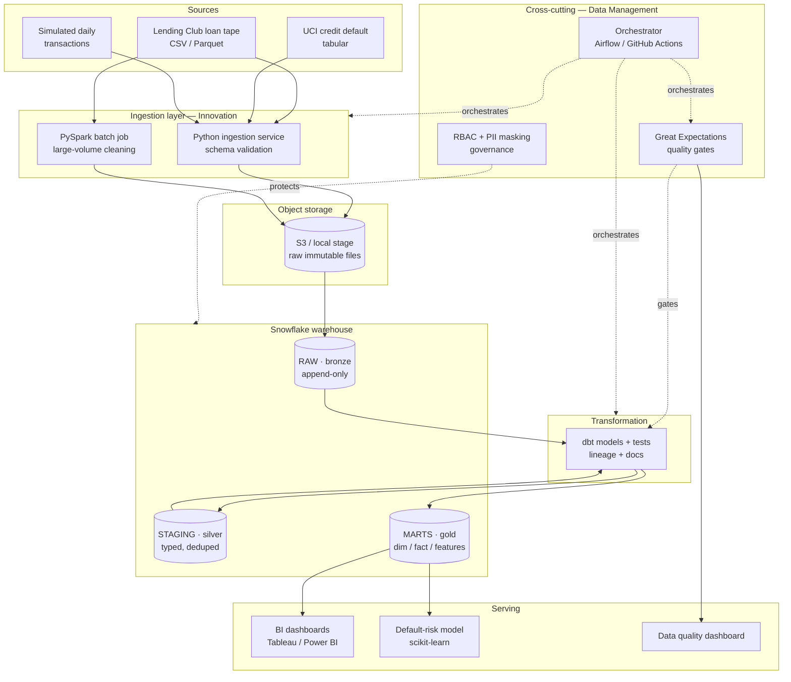

# CreditPulse — Credit Portfolio Analytics & Data Quality Platform

> An end-to-end, well-managed data platform that ingests raw credit and lending data, builds a governed Snowflake warehouse with dbt, runs automated data-quality monitoring, and serves portfolio-risk insights through BI dashboards and a default-prediction model.

<p>
  
  
  
  
  
  
</p>

---

## Table of contents

1. [Project overview](#1-project-overview)
2. [The problem & why it matters](#2-the-problem--why-it-matters)
3. [What this platform does](#3-what-this-platform-does)
4. [Architecture at a glance](#4-architecture-at-a-glance)
5. [Tech stack](#5-tech-stack)
6. [Data sources](#6-data-sources)
7. [Repository structure](#7-repository-structure)
8. [Data model (medallion)](#8-data-model-medallion)
9. [Data quality framework](#9-data-quality-framework)
10. [Data governance & security](#10-data-governance--security)
11. [Business intelligence & ML](#11-business-intelligence--ml)
12. [Orchestration & CI/CD](#12-orchestration--cicd)
13. [Getting started](#13-getting-started)
14. [Environments](#14-environments)
15. [Observability & SLAs](#15-observability--slas)
16. [Roadmap](#16-roadmap)
17. [License](#17-license)

---

## 1. Project overview

**CreditPulse** is a portfolio-analytics platform built around the lifecycle of consumer credit and lending data. It demonstrates a complete, production-shaped data stack: raw data is ingested and landed in object storage, transformed into a layered (bronze → silver → gold) Snowflake warehouse using dbt, continuously validated by an automated data-quality engine, governed with role-based access and PII masking, and finally exposed to analysts through dashboards and to risk teams through a default-prediction model.

The project is organized around the three disciplines a modern data analyst is expected to own end to end:

| Pillar | What it covers in this project |
| --- | --- |
| **Innovation** | Open-source ingestion of large, varied, messy data; dbt-based self-service data models; rapid adoption of new tooling (dbt, Great Expectations). |
| **Business Intelligence** | KPI dashboards (default rate, delinquency, approval mix), segment analysis, and a statistical default-risk model that drives portfolio strategy. |
| **Data Management** | Automated data-quality monitoring, column- and table-level lineage, a business glossary / data dictionary, and access governance with PII masking. |

It is intentionally a *thin slice of a real production platform* — the same architecture a financial-services data team would deploy, scaled down to run on free tiers, with every production component documented in [`ARCHITECTURE.md`](./ARCHITECTURE.md).

### What runs today (local DuckDB build)

This repo is being built phase by phase. The README below describes the full **production target** (Snowflake-centric); the table tracks what is actually implemented and runnable locally on DuckDB.

| Phase | Status | What works locally |
| --- | --- | --- |
| 1 · Scaffold + env | ✅ | Python 3.12 venv, dbt-duckdb project, `dbt debug` green |
| 2 · Ingest + bronze | ✅ | Real UCI dataset + synthetic Faker feed landed to `raw.*` with load metadata; Lending Club streams via DuckDB when a file is dropped in `data/raw/lending_club/` |
| 3 · Silver + gold | ✅ | Staging (typed/deduped/PII-tagged) → `dim_borrower`, `fct_payment_history`, `mart_portfolio_risk`, `feature_default_prediction`; all dbt-tested |
| 4 · Data quality | ✅ | Great Expectations 1.x gate (blocking/warning tiers) + `dbt source freshness`; results in `meta.dq_results` / `meta.mart_data_quality` |
| 5 · Governance | ✅ | Masking + row-access as role-scoped views in the `governance` schema; production Snowflake DDL in [`governance/`](./governance) |
| 6 · ML | ✅ | Logistic-regression baseline + XGBoost on the gold feature table; evaluated on AUC / KS / Brier / calibration; PD per borrower in `meta.model_scores` (test AUC ≈ 0.77) |
| 7 · Dashboard | ✅ | Streamlit app (`bi/streamlit_app.py`) — portfolio, risk/delinquency, model-scores, and data-quality tabs reading the gold marts + `meta` tables |
| 8 · Orchestration + CI | ✅ | `orchestration/run_pipeline.py` chains the full flow with retries + gate-halt; GitHub Actions CI (sqlfluff + build + tests + quality gate) and nightly scheduled run; production Airflow DAG in `orchestration/dags/` |

**Local vs production swaps that matter:** the warehouse is **DuckDB** (a file at `warehouse/creditpulse.duckdb`), not Snowflake. Great Expectations 1.x has **no CLI** — the checkpoint runs via `python quality/run_quality_checks.py`. Governance is simulated with views because DuckDB has no Snowflake-style RBAC/masking policies. The venv uses **Python 3.12** (3.11 was not installed; 3.12 is fully supported). See [`CLAUDE.md`](./CLAUDE.md) for the local command reference.

---

## 2. The problem & why it matters

Lenders make money by pricing risk correctly. Approve too freely and charge-offs erode the book; approve too tightly and you leave profitable customers on the table. Answering "which segments are driving our losses, and can we predict default before it happens?" requires:

- **Trustworthy data** — if the delinquency feed silently drops 5% of records one morning, every downstream metric lies.
- **Clear lineage** — when a regulator or an executive asks "where did this default-rate number come from?", you must trace it from dashboard back to raw source.
- **Governed access** — borrower PII (income, address, SSN-like identifiers) must be masked from analysts who don't need it.
- **Fast, self-service insight** — analysts shouldn't file a ticket every time they want to slice the portfolio a new way.

CreditPulse builds exactly that backbone: a quality-checked, lineage-traced, access-governed warehouse that turns raw loan tapes into reliable risk insight.

---

## 3. What this platform does

```
Raw loan & credit data
        │
        ▼
[ Ingest ]   Python / PySpark pulls, validates schema, lands raw to object storage
        │
        ▼
[ Load ]     External stage → Snowflake RAW (bronze), append-only, partitioned by load date
        │
        ▼
[ Transform ] dbt builds STAGING (silver: typed, deduped, conformed) → MARTS (gold: dim/fact + features)
        │
        ├─► [ Quality ]   Great Expectations + dbt tests gate every run; results logged to a DQ mart
        ├─► [ Govern ]    RBAC roles, dynamic PII masking, row-access policies, object tagging
        ├─► [ BI ]        Tableau / Power BI dashboards on gold marts
        └─► [ ML ]        Default-prediction model trained on the gold feature table
```

A scheduled orchestration job runs the full chain (`ingest → load → dbt build → quality checkpoint → refresh BI extracts`) and alerts on failure or freshness breaches.

---

## 4. Architecture at a glance

The platform follows a layered, **ELT + medallion** design. Full detail — every component, environment, data contract, and failure mode — lives in [`ARCHITECTURE.md`](./ARCHITECTURE.md).



---

## 5. Tech stack

Each component lists the **production tool** and the **zero-cost local swap** so the platform runs identically whether on cloud or on a laptop.

| Layer | Production | Local / free swap |
| --- | --- | --- |
| Ingestion | Python 3.11, PySpark on EMR | Python + local PySpark |
| Object storage | AWS S3 | local filesystem stage |
| Warehouse | Snowflake | DuckDB (near-identical SQL) |
| Transformation | dbt-core / dbt Cloud | dbt-core |
| Data quality | Great Expectations + dbt tests | same (both open source) |
| Orchestration | Apache Airflow / Dagster | GitHub Actions (scheduled) |
| BI | Tableau / Power BI | Tableau Public / Streamlit |
| ML | scikit-learn, XGBoost | same |
| CI/CD | GitHub Actions + sqlfluff | same |
| Secrets | AWS Secrets Manager | `.env` + GitHub Secrets |

---

## 6. Data sources

| Source | Description | Role in project |
| --- | --- | --- |
| **Lending Club loan data** | ~2M+ historical loans with status, grade, rate, term | "voluminous / varied" ingestion; PySpark cleaning; portfolio analytics |
| **UCI "Default of Credit Card Clients"** | ~30K clients with payment history and default flag | clean, labeled set for the default-prediction model |
| **Simulated transactions** | Generated daily feed (Python `Faker`) | demonstrates incremental loads, freshness checks, streaming-style ingestion |

All sources are public or synthetic; no real borrower data is used. PII-shaped columns are synthetic and exist only to demonstrate masking.

---

## 7. Repository structure

```
creditpulse/
├── README.md
├── ARCHITECTURE.md                # production-level architecture deep dive
├── docs/
│   ├── data_dictionary.md         # business definitions / glossary
│   ├── data_contracts.md          # schema + freshness SLAs per source
│   └── adr/                       # architecture decision records
├── ingestion/
│   ├── extract_lending_club.py
│   ├── spark_clean.py             # PySpark large-volume cleaning
│   ├── generate_transactions.py   # synthetic daily feed
│   └── load_to_snowflake.py       # stage → RAW loader
├── dbt/
│   ├── dbt_project.yml
│   ├── models/
│   │   ├── staging/               # silver: typed, deduped, conformed
│   │   ├── intermediate/
│   │   └── marts/
│   │       ├── core/              # dim_borrower, fct_loan, fct_payment
│   │       ├── risk/              # portfolio risk + delinquency marts
│   │       └── ml/                # gold feature table for the model
│   ├── tests/                     # custom data tests
│   ├── macros/                    # PII masking, reusable logic
│   └── snapshots/                 # SCD2 history
├── quality/
│   ├── great_expectations/        # suites + checkpoints
│   └── publish_dq_results.py      # writes results to DQ mart
├── governance/
│   ├── roles.sql                  # RBAC role hierarchy
│   ├── masking_policies.sql       # dynamic data masking on PII
│   └── row_access_policies.sql
├── ml/
│   ├── features.py
│   ├── train.py                   # default-prediction model
│   └── evaluate.py
├── bi/
│   ├── tableau/                   # packaged workbooks
│   └── streamlit_app.py           # alt free dashboard
├── orchestration/
│   ├── dags/                      # Airflow DAGs (prod)
│   └── github_actions_pipeline.yml
├── .github/workflows/
│   ├── ci.yml                     # lint + dbt build + GE on PR
│   └── scheduled_pipeline.yml     # nightly run
├── infra/                         # IaC (Terraform) — optional
├── requirements.txt
├── profiles.example.yml
└── .env.example
```

---

## 8. Data model (medallion)

The warehouse is layered so that raw fidelity, cleaning, and business logic are cleanly separated — this is what makes lineage and quality enforceable.

- **RAW (bronze)** — exact, immutable copy of source files. Append-only, partitioned by `load_date`. Never edited; the system of record for replay.
- **STAGING (silver)** — one staging model per source: enforced data types, deduplication, standardized naming, `not_null`/`unique` tests, PII columns tagged. No business logic yet.
- **MARTS (gold)** — business-ready models:
  - `core` — conformed dimensions and facts (`dim_borrower`, `dim_date`, `fct_loan`, `fct_payment`).
  - `risk` — `mart_portfolio_risk`, `mart_delinquency_trend`, `mart_vintage_curves`.
  - `ml` — `feature_default_prediction`, a single wide table feeding the model so training and serving share one definition.

Slowly-changing borrower attributes are captured with dbt **snapshots** (SCD type 2) so historical risk can be recomputed accurately.

---

## 9. Data quality framework

Quality is enforced as a **gate**, not an afterthought — a failed critical check stops the pipeline before bad data reaches dashboards.

- **dbt tests** — `not_null`, `unique`, `accepted_values`, `relationships` (referential integrity), plus custom tests (e.g. `loan_amount >= 0`, default flag ∈ {0,1}).
- **Great Expectations checkpoints** — distributional and volume checks: row-count within expected band, null-rate thresholds, column value ranges, schema drift detection.
- **Source freshness** — dbt `source freshness` fails the run if a feed is stale beyond its SLA.
- **DQ reporting** — every check result is written to a `mart_data_quality` table and surfaced on a dedicated quality dashboard, so trust is observable over time.

Checks are tiered: **blocking** (stop the pipeline) vs **warning** (log and alert, continue).

---

## 10. Data governance & security

- **RBAC role hierarchy** — `LOADER` (write RAW), `TRANSFORMER` (dbt build), `ANALYST` (read MARTS, masked PII), `RISK_ANALYST` (read unmasked under policy), `ADMIN`.
- **Dynamic data masking** — Snowflake masking policies hide PII-shaped columns (income, address, identifiers) from `ANALYST` while showing them to authorized roles.
- **Row-access policies** — restrict rows by attribute (e.g. region) to demonstrate fine-grained governance.
- **Object tagging & catalog** — tables and columns tagged with classification (`PII`, `CONFIDENTIAL`, `PUBLIC`); the data dictionary maps every gold column to a business definition and owner.
- **Lineage** — `dbt docs generate` produces a navigable DAG from raw source to dashboard column, satisfying "where did this number come from?".
- **Secrets** — never committed; key-pair auth to Snowflake, secrets in environment / GitHub Secrets / AWS Secrets Manager.

---

## 11. Business intelligence & ML

**Dashboards** (gold marts):
- Portfolio overview — outstanding balance, weighted avg rate, approval mix.
- Risk & delinquency — default rate by grade/term/segment, roll-rate / vintage curves.
- Data quality — freshness, test pass rate, volume trends.

**Default-prediction model:**
- Trained on `feature_default_prediction` (gold), so features are governed and reproducible.
- Logistic regression baseline + gradient-boosted model; evaluated on AUC, KS, and a calibration curve.
- Outputs a risk score per borrower segment that feeds the strategy narrative ("segment X drives N% of expected loss").

This deliberately echoes the discipline's roots: individualized statistical risk scoring on a relational backbone.

---

## 12. Orchestration & CI/CD

**Orchestration** — a single DAG runs the chain nightly:
`extract → spark_clean → load_to_snowflake → dbt build → great_expectations checkpoint → publish DQ → refresh BI extracts`, with retries, on-failure alerts, and freshness gating. Airflow/Dagster in production; a scheduled GitHub Actions workflow for the free build.

**CI/CD** — on every pull request:
- `sqlfluff` lint + `dbt parse`
- `dbt build` against an isolated CI schema (Slim CI with state deferral so only changed models run)
- Great Expectations validation
- merge to `main` deploys to the production target

The project is managed in **sprints** on a GitHub Projects board (Agile), with Architecture Decision Records under `docs/adr/` documenting key choices.

---

## 13. Getting started

### Prerequisites
- Python 3.11+, `pip`
- A Snowflake trial account *(or DuckDB for fully local mode)*
- `dbt-snowflake` *(or `dbt-duckdb`)*

### Quickstart (local / DuckDB mode)
```bash
# 1. Clone & install (Python 3.12)
git clone https://github.com/<you>/creditpulse.git
cd creditpulse
python3.12 -m venv .venv && source .venv/bin/activate
pip install -r requirements.txt

# 2. Configure (a working dbt profile already lives at dbt/profiles.yml)
cp .env.example .env

# 3. Ingest & load to bronze (DuckDB RAW)
python ingestion/extract_uci.py            # real UCI default-of-credit dataset
python ingestion/generate_transactions.py  # synthetic Faker payment feed
python ingestion/load_to_duckdb.py         # land sources to raw.* (Lending Club if present)

# 4. Build the warehouse (run dbt from ./dbt)
cd dbt && dbt build                        # staging -> marts -> governance + tests
dbt source freshness                       # freshness SLAs
dbt docs generate && dbt docs serve        # explore lineage

# 5. Quality gate (Great Expectations 1.x — Python API, no CLI)
cd .. && python quality/run_quality_checks.py     # exits non-zero on blocking failure

# 6. ML — train + evaluate the default-prediction model
python ml/train.py        # logistic regression + XGBoost -> ml/artifacts/
python ml/evaluate.py     # AUC / KS / calibration + writes meta.model_scores

# 7. Dashboard
streamlit run bi/streamlit_app.py     # portfolio, risk, model & data-quality tabs
```

---

## 14. Environments

| Env | Snowflake database prefix | dbt target | Trigger |
| --- | --- | --- | --- |
| `dev` | `CREDITPULSE_DEV_*` | `dev` | local developer runs |
| `ci` | `CREDITPULSE_CI_*` | `ci` | pull request (ephemeral schema) |
| `prod` | `CREDITPULSE_PROD_*` | `prod` | merge to `main` / scheduled |

Each environment is fully isolated at the database level; promotion is code-only via Git.

---

## 15. Observability & SLAs

- **Freshness SLA** — each source declares a max-staleness; breach fails the run and alerts.
- **Test pass-rate SLA** — blocking tests must be 100%; warning tests tracked over time.
- **Pipeline alerting** — failures post to Slack/email with the failing step and run URL.
- **Run history** — orchestrator logs every run; the DQ mart retains historical check results for trend analysis.

---

## 16. Roadmap

- [ ] Incremental Snowpipe ingestion for the simulated transaction feed
- [ ] Feature store integration so the model and dashboards share one feature definition
- [ ] dbt contracts (enforced schemas) on all gold models
- [ ] Anomaly detection on data-quality metrics
- [ ] Model monitoring (drift, performance decay) with retraining trigger

---

## 17. License

Released under the MIT License. Data sources are public/synthetic and subject to their own licenses; no real personal data is included.
